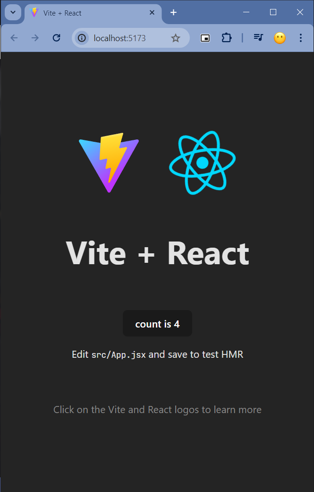

# 4.3 React App 구동원리 살펴보기



```jsx
<script type="module" src="/src/main.jsx"></script>
```

`main.jsx` 파일에서 요소를 가져와 화면에 보일 수 있는 것이다.

```jsx
ReactDOM.createRoot(document.getElementById('root')).render(
  <React.StrictMode>
    <App />
  </React.StrictMode>,
)
```
root를 id로 갖는 요소를 get 하여 인수로 전달하여 리액트의 Root로 변환하는 것이다. 이 루트 아래에 App 컴포넌트를 렌더링한다. 

App 컴포넌트는 `App.jsx`에서 확인할 수 있는데 App 함수가 리턴하는 요소들을 화면에 렌더링한다.
리턴 부분을 지우고 원하는 요소를 작성하여 이를 렌더링 할 수 있다

```
return (
    <>
      <h1>안녕하세요!!</h1>
    </>
)
```